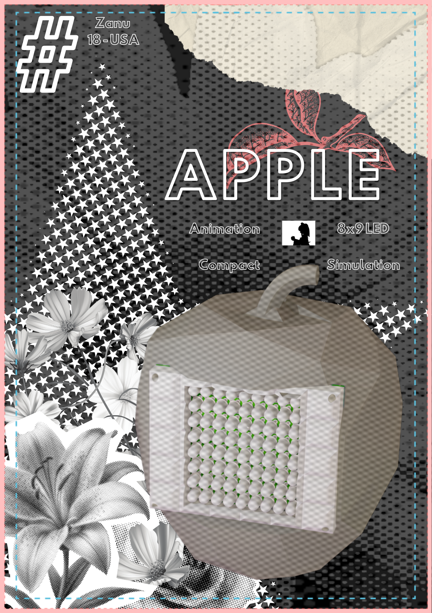

# Apple

Hello! Welcome, this is my **fourth** hardware project! This time I wanted to make a cool animation device thingy!

This is a fully custom (to scale) apple with a 8x9 LED matrix, capable of playing custom animations!

## Why I made it!!!
I wanted to learn how to do led multiplexing and build custom animations via code. 

[Full Assembly Onshape](https://cad.onshape.com/documents/c4cca5d70cfbcf064b8f5573/w/e431c97fb434e0044b124243/e/bd3734d46569e5d5d04dbcf3?renderMode=0&uiState=6a0f1f6dcd5d88f88ef211f1)

## Basic Overview - Parts
- x2 70mm x 90mm perf boards 
- x1 esp 32 or similar board (Used this as I had one laying around)
- x72 White LEDs
- x1 spool of solid core wire
- x8 PNP Transistors
- x8 1k ohm Resistor
- x9 150 ohm Resistor

# Instructions

### Required Tools
- [3D Printer](https://us.store.bambulab.com/products/a1?srsltid=AfmBOooBF1VulJOcN0w0Dw9eKBr-6jUI9S0_6fC8T1UrhNsn2X_tcuJB&id=579550514255634444)
- [Soldering Iron](https://www.homedepot.com/p/Weller-Digital-Soldering-Station-WE1010NA/304947077)

## Step By Step Guide

### Step 1 - 3d Printing
Start by downloading the .STEP file from the github repo. Ensure you have a slicer downloaded like Orca slicer or Bambu Handy. Upload the .STEP file to the slicer and use the following settings:

- Sparse infill density: 15%
-  infill pattern: Gyroid
- Brim Setting: False 

1. Print out the apple and Print out the PCB Cover.

### Step 2 - Assembly

Prepare work station with 
- Soldering iron
- Lead free Solder
- x2 perf board, 
- x72 White LEDs
- x1 spool of solid core wire
- x8 PNP Transistors
- x8 1k ohm Resistor
- x9 150 ohm Resistor

1. Heat soldering iron to 315 degrees C
2. secure the perf board down with a pair of helping hands or similar method.
3. starting 4 pins away from the left side of the board and 3 pin bellow the top of the board, solder the cathode of a single LED. Then solder the anode of the same LED to the pin left of the cathode. 
4. Repeat this soldering process for the entire row until you have soldered 8 total LEDs. 
5. Now repeat steps 3 and 4 this time starting the row three pins below the first row.
6. Repeat until you have an LED matrix consisting of 8 rows and 9 columns.  
7. Now Bridge each of the anodes together and bridge each of the cathodes together using solid core wire. 

8. Now prepare to solder your 150 ohm resistors.
9. Flip the board to its backside
10. Solder one 150 ohm resistor to each bottom column's cathode.   

11. Now prepare to solder your Transistors.  
12. Solder one transistor with the emitter one pin away from the right-most LED row pin.  
13. Solder the rest of the transistor pins horizontal to the led rows. 
14. repeat steps 11 and 12 until you have soldered all of the transistors for each row. 

15. Now prepare to solder the 1k ohm resistors
16. Solder one 1k ohm resistor to the collector of one of the pnp transistors (middle pin) and connect it to the pin right underneath the collector pin. 
17. Repeat step 15 until you have soldered all of the 1k ohm resistors for each of the transistors.

18. Prepare to bridge the transistors
19. Cut and strip solid core wire such that you can bridge all of the Base pins of each of the transistors. 
20. Solder the solid core wire between each of the transistors such that all 8 are connected (ensure you have extra wire at the bottom to bridge out to the micro controller. 

21. Now on a the second perf board, solder the esp 32 at the middle using soldering pins.
22. Connect wires from the esp32 to the perf board with all the components as according to the wiring diagram.  

23. After everything is connected plug in the esp32 and flash the firmware attached in the Github.
24. Once flashed prepare all components to be combined into the final product (3d printed case + 3d Printed PCB cover + PCB Perf board.  
25. Open the apple case and insert the electrical components.
26. Secure the LED perf board to the apple with 4 m3 screws. 
27. Place the other ESP32 perf board in the apple (ensuring that it lines up with the usbc hole) and close everything up

#### Finished! 

Now you have the finished product! You can upload new animations with a usb-c cable!

# Credits
- Made Zine with Canva
- CAD done with Onshape
- MD file written with [StackEdit](https://stackedit.io/).

